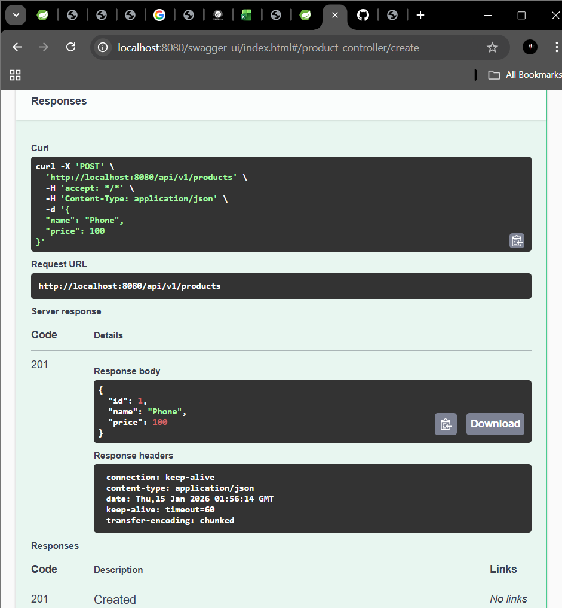
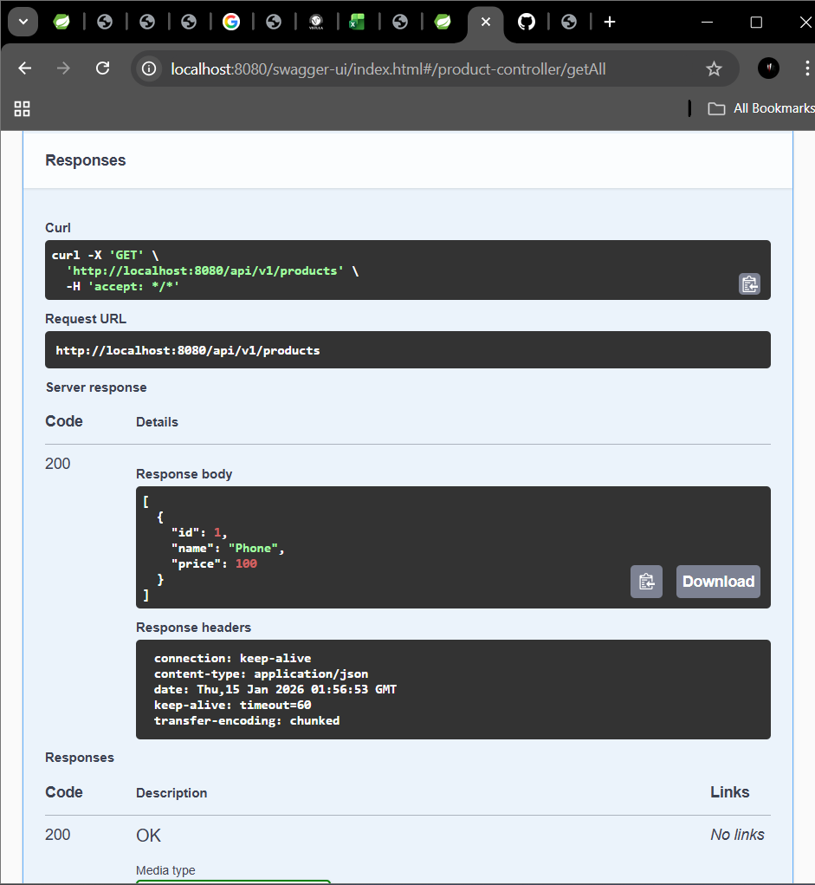
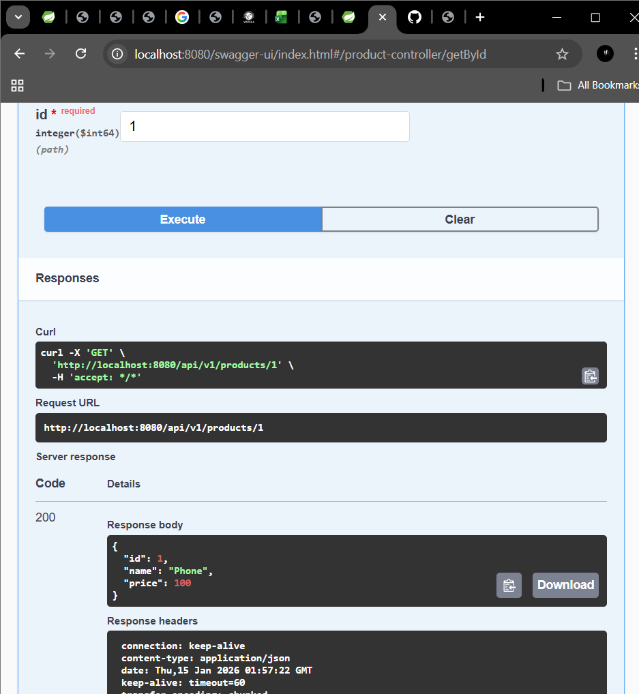
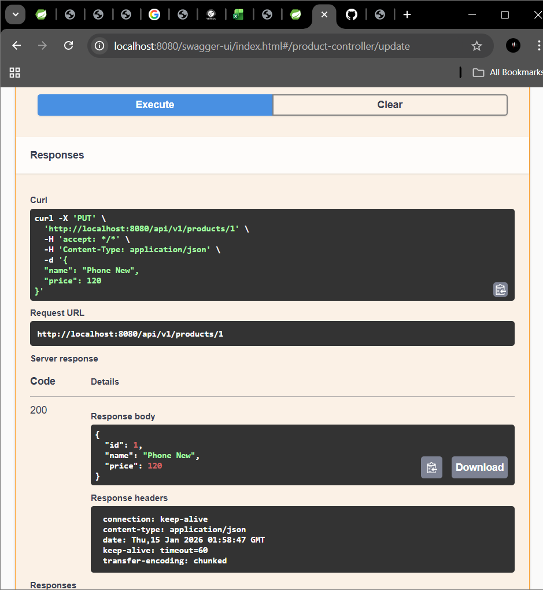
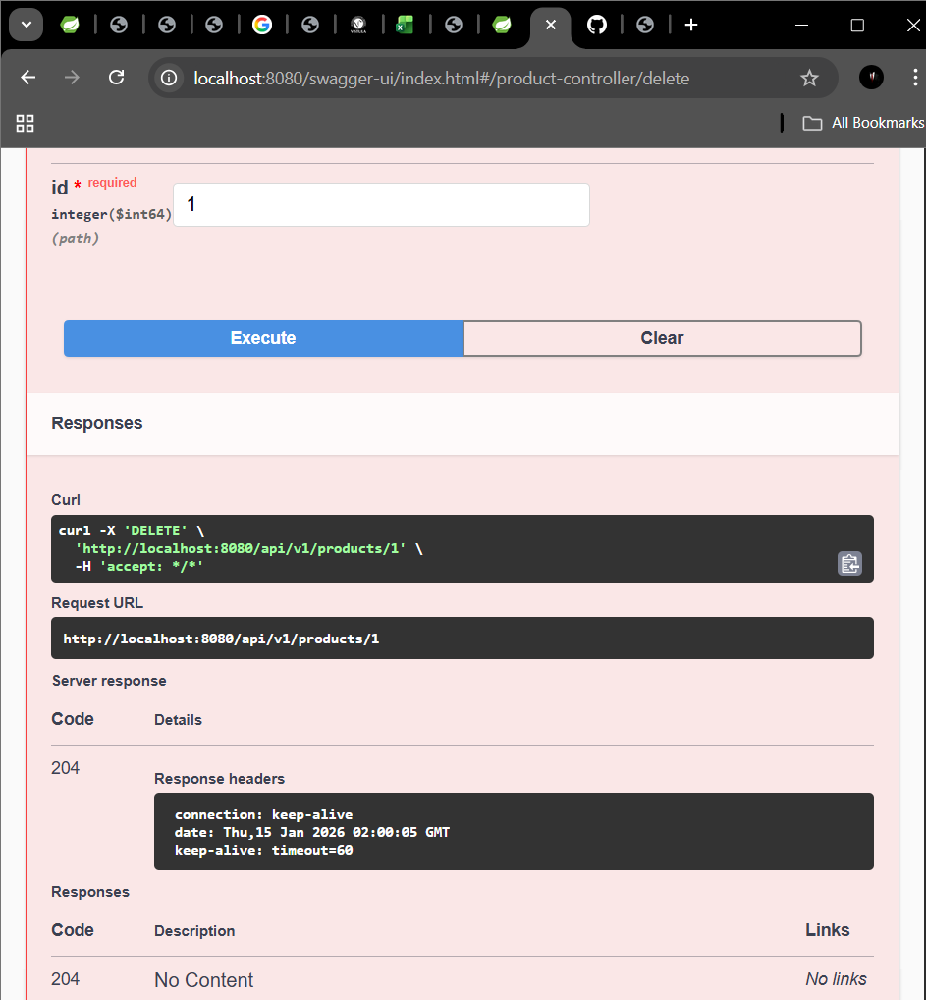
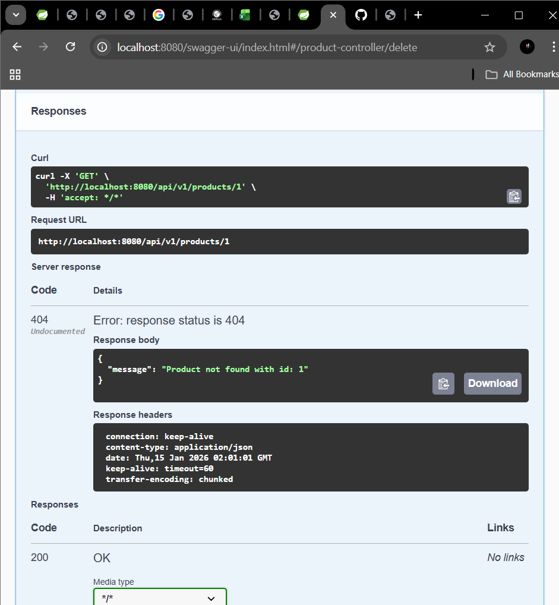
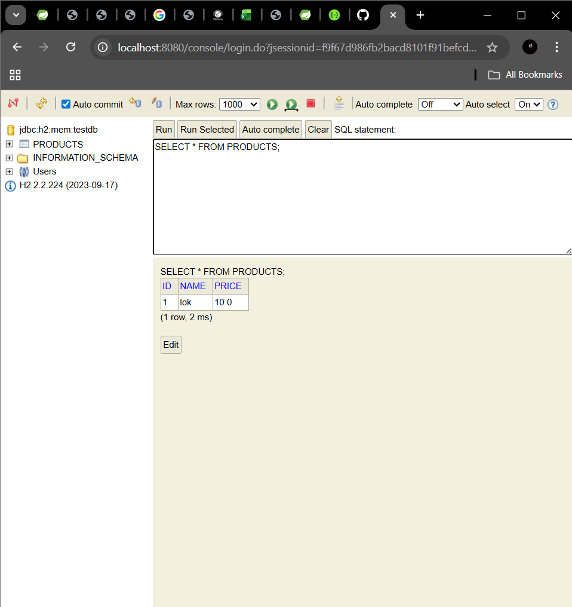

# Task 2 - Spring Boot REST API (Products)

This project is a REST API application built with Spring Boot.

## ✅ Technologies
- Java 17
- Spring Boot
- Spring Web
- Spring Data JPA
- H2 Database (in-memory)
- Swagger UI (Springdoc OpenAPI)

## ✅ Endpoints
- POST `/api/v1/products`
- GET `/api/v1/products`
- GET `/api/v1/products/{id}`
- PUT `/api/v1/products/{id}`
- DELETE `/api/v1/products/{id}`

## ✅ Swagger UI
Open in browser:
http://localhost:8080/swagger-ui/index.html

## ✅ H2 Console
Open in browser:
http://localhost:8080/console

Login settings:
- JDBC URL: `jdbc:h2:mem:testdb`
- Username: `sa`
- Password: (empty)

## ✅ Notes
- The database is in-memory, so data will be cleared after application restart.

## ✅ Screenshots

### ✅ Swagger POST

### ✅ Swagger GET ALL

### ✅ Swagger GET BY ID

### ✅ Swagger PUT Update

### ✅ Swagger DELETE

### ✅ ERROR

### ✅ H2 Console

